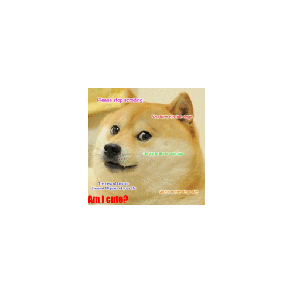

```{r setup, include=FALSE}
knitr::opts_chunk$set(echo = TRUE)
```

## My meme

For my meme, I wanted to create a humorous take on a popular cultural reference using R and the magick package, combining my interest in data analysis with my humor on a cute doge.


```{r file='meme.R', eval=FALSE}
library(magick)


# Read the original meme and get the dimensions
meme_original <- image_read("https://i.imgflip.com/7dcyym.jpg")

#square two
text <- image_blank(width = 500, 
                           height = 500, 
                           color = "#000000") %>%
  image_annotate(text = "DOGE CUTE!!!",
                 color = "#ff6699",
                 size = 80,
                 font = "Impact",
                 gravity = "center")

meme_vector <- c(meme_original, text)

meme <- image_append(meme_vector, stack = TRUE)
image_write(meme, "my_meme.png")
```

## My animated GIF

The image will zoom in and the text will change to make it much fun.


```{r file='meme.R', eval=FALSE}

library(magick)

# Read the original meme and get the dimensions
meme_original <- image_read("https://i.imgflip.com/7dcyym.jpg") %>%
  image_scale(500)

# creating each frame
frame1 <- meme_original %>%
  image_annotate(text = "Am I cute?", color = "red", font = "impact", size = 40, gravity = "southwest") %>%
  image_scale(200) %>%
  image_extent("500x500")

frame2 <- meme_original %>%
  image_annotate(text = "Am I cute?", color = "white", size = 60, gravity = "southeast") %>%
  image_scale(300) %>%
  image_extent("500x500")

frame3 <- meme_original %>%
  image_annotate(text = "Am I cute?", color = "blue", font = "impact", size = 75, gravity = "north") %>%
  image_scale(400) %>%
  image_extent("500x500")

frame4 <- meme_original %>%
  image_annotate(text = "!!Doge!!",color = "orange", font = "Impact", size = 95, gravity = "south") %>%
  image_scale(500)


frames <- c(frame1, frame2, frame3, frame4)
animation <- image_animate(frames, fps = 2)
image_write(animation, "my_animation.gif")
```

