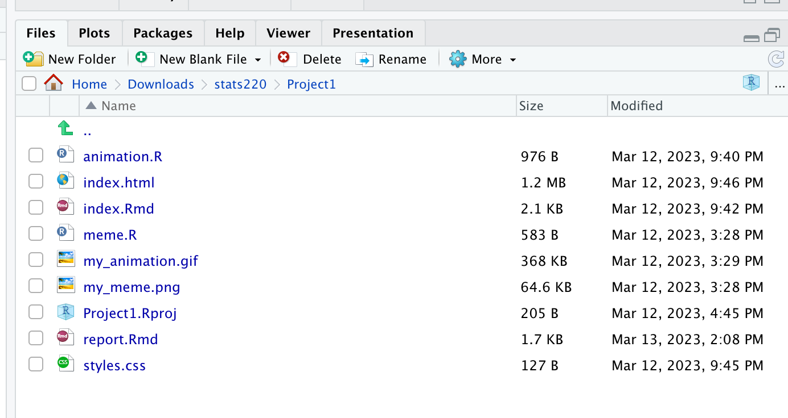

## Project requirements

For this project, I have met the requirements related to working with GitHub and GitHub Pages by creating a repository on GitHub, committing and pushing my code to the repository, and creating a website using GitHub Pages. The links to my repository and website are:

- [GitHub repository](https://github.com/fyu855/stats220/project1)
- [GitHub Pages website](https://fyu855.github.io/stats220/project1/index.html)

Here is a screenshot of the project folder on my computer:

My project demonstrates creativity by going beyond the requirements of the assignment in several ways. For example, I used additional functions from the {magick} package to create my images, added custom CSS styles to my HTML report to make it more visually appealing, and included additional context in my meme and animated GIF to make them more relevant and humorous.

## Learning reflection

In this project I uses the {magick} package to read in an original meme image from a URL, create a blank image of the same size as the original, add text to the blank image using the image_annotate() function. I also learnt how to combine different images to generate GIF.

One important idea that I learned from Module 1 Creating HTML by combining modern technologies is the importance of using version control systems like Git and GitHub when working on coding projects.

In terms of data technologies that I am more curious about exploring further, I am interested in learning more about data visualization tools like {ggplot2} and {plotly} in R, as well as exploring different data sources and APIs to work with more diverse datasets.

